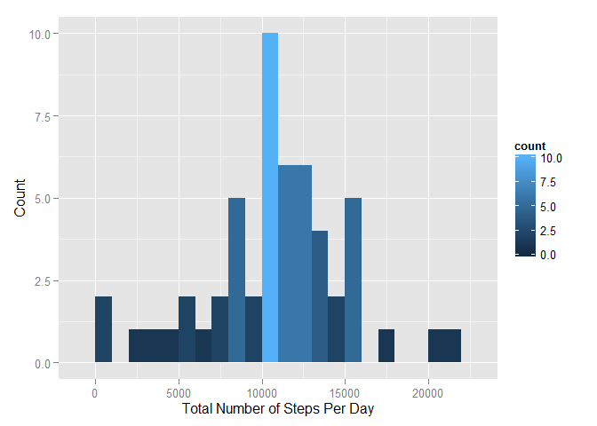
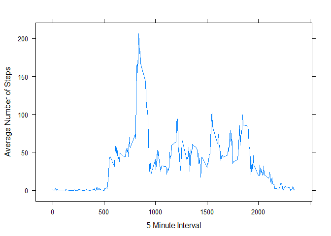
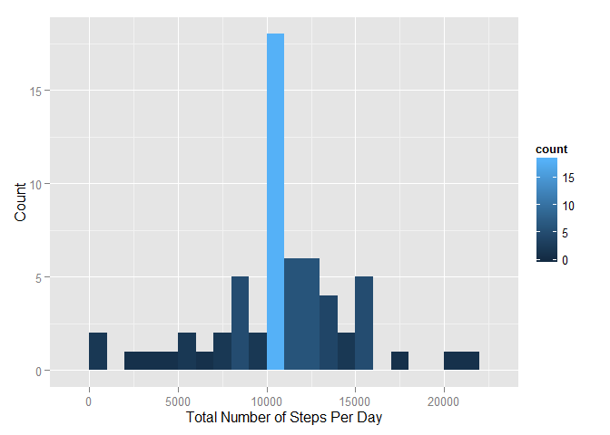
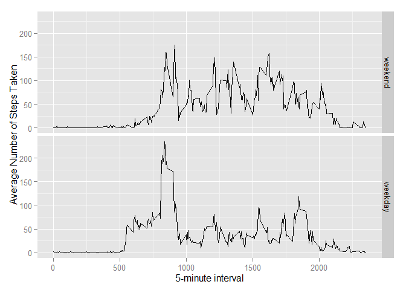

# Reproducible Research: Peer Assessment 1
Simon Chan  
Sunday, August 16, 2015  

This assignment makes use of data from a personal activity monitoring device. This device collects data at 5 minute intervals through out the day. The data consists of two months of data from an anonymous individual collected during the months of October and November, 2012 and include the number of steps taken in 5 minute intervals each day.  

The data for this assignment can be downloaded from the course web site:
Dataset: [Activity monitoring data (52K)](https://d396qusza40orc.cloudfront.net/repdata%2Fdata%2Factivity.zip)  


The variables included in this dataset are:  

- steps: Number of steps taking in a 5-minute interval (missing values are coded as NA)   
- date: The date on which the measurement was taken in YYYY-MM-DD format   
- interval: Identifier for the 5-minute interval in which measurement was taken  

The dataset is stored in a comma-separated-value (CSV) file and there are a total of 17,568 observations in this dataset.  

##Loading and preprocessing the data  


```r
library(plyr)
library(ggplot2)
library(lattice)
unzip(zipfile = "activity.zip")
activity = read.csv("activity.csv")
# convert date from factor to date
activity$date<-as.Date(activity$date)
summary(activity)
```

```
##      steps             date               interval     
##  Min.   :  0.00   Min.   :2012-10-01   Min.   :   0.0  
##  1st Qu.:  0.00   1st Qu.:2012-10-16   1st Qu.: 588.8  
##  Median :  0.00   Median :2012-10-31   Median :1177.5  
##  Mean   : 37.38   Mean   :2012-10-31   Mean   :1177.5  
##  3rd Qu.: 12.00   3rd Qu.:2012-11-15   3rd Qu.:1766.2  
##  Max.   :806.00   Max.   :2012-11-30   Max.   :2355.0  
##  NA's   :2304
```
##What is mean total number of steps taken per day? 

####1. Calculate the total number of steps taken per day

```r
# calculate total number of steps per day
steps_perday <- aggregate(steps ~ date, data = activity, FUN=sum)
```

####2. Make a histogram of the total number of steps taken each day

```r
# plot the frequency histogram for number of steps per day
qplot(steps, data=steps_perday, geom="histogram", binwidth=1000, fill=..count.., xlab = "Total Number of Steps Per Day", ylab = "Count")
```

 

####3. Calculate and report the mean and median of the total number of steps taken per day
The **mean** of the total number of steps taken per day is

```r
mean(steps_perday$steps, na.rm=TRUE)
```

```
## [1] 10766.19
```
The **median** of the total number of steps taken per day is

```r
median(steps_perday$steps, na.rm=TRUE)
```

```
## [1] 10765
```

##What is the average daily activity pattern? 

####1. Make a time series plot (i.e. type = "l") of the 5-minute interval (x-axis) and the average number of steps taken, averaged across all days (y-axis)


```r
# calculate average steps by interval across days
steps_byinterval <- aggregate(steps ~ interval, data = activity, FUN=mean)
# plot the time series diagram for mean number of steps by interval
xyplot(steps ~ interval, data=steps_byinterval, xlab = "5 Minute Interval", ylab = "Average Number of Steps", type="l")
```

 

####2. Which 5-minute interval, on average across all the days in the dataset, contains the maximum number of steps?

5-minute interval, on average across all the days in the dataset, contains the **maximum number of steps** is 

```r
steps_byinterval[which.max(steps_byinterval$steps),1]
```

```
## [1] 835
```

##Imputing missing values 

####1. Calculate and report the total number of missing values in the dataset (i.e. the total number of rows with NAs)


```r
sum(is.na(activity))
```

```
## [1] 2304
```

####2. Devise a strategy for filling in all of the missing values in the dataset. The strategy does not need to be sophisticated. For example, you could use the mean/median for that day, or the mean for that 5-minute interval, etc.

To impute the missing values we must make some reasonable assumptions.  

**Assumption**  
The daily step patterns by interval is similar for the individual (Man is largely a creature of habit).  

Based on the above assumptions we can use the average activity by interval for imputing the missing values. 

####3. Create a new dataset that is equal to the original dataset but with the missing data filled in.


```r
## create a new dataset with imputed missing values  
activity1 <- activity
for (i in 1:nrow(activity1) ) {
        if (is.na(activity1[i, 1]) == TRUE) {
                activity1[i,1] = steps_byinterval[which(steps_byinterval$interval == activity1[i,]$interval),2]
        } 
}
```

####4. Make a histogram of the total number of steps taken each day and Calculate the mean and median total number of steps taken per day. Do these values differ from the estimates from the first part of the assignment? What is the impact of imputing missing data on the estimates of the total daily number of steps?


```r
# summarize total number of steps per day
steps_perday1 <- aggregate(steps ~ date, data = activity1, FUN=sum)
# plot the frequency histogram for number of steps per day
qplot(steps, data=steps_perday1, geom="histogram", binwidth=1000, fill=..count.., xlab = "Total Number of Steps Per Day", ylab = "Count")
```

 

The **mean** of the total number of steps taken per day is  

```r
mean(steps_perday1$steps, na.rm=TRUE)
```

```
## [1] 10766.19
```

The **median** of the total number of steps taken per day is  

```r
median(steps_perday1$steps, na.rm=TRUE)
```

```
## [1] 10766.19
```

####What is the impact of imputing missing data on the estimates of the total daily number of steps?

Imputing missing data cause the overall daily steps to increase. It also caused the median to increase but the mean remains constant.  
(The behaviour of the mean and median is dependent on the strategy for imputing missing values)

##Are there differences in activity patterns between weekdays and weekends?  

####1. Create a new factor variable in the dataset with two levels - "weekday" and "weekend" indicating whether a given date is a weekday or weekend day.  


```r
# create a list of weekdays
weekdayslist <- c('Monday', 'Tuesday', 'Wednesday', 'Thursday', 'Friday')
# add a new factor variable "daysofweek" and and set to "weekday" or "weekend" depending on the date
activity1 <- mutate(activity1, daysofweek = factor((weekdays(date) %in% weekdayslist), levels=c(FALSE, TRUE), labels=c('weekend', 'weekday') ))
```


####2. Make a panel plot containing a time series plot (i.e. type = "l") of the 5-minute interval (x-axis) and the average number of steps taken, averaged across all weekday days or weekend days (y-axis).  


```r
# calculate average steps by interval and by days of week (dow)
steps_byint_bydow <-aggregate(steps ~ interval+daysofweek, data = activity1, FUN=mean, na.rm=TRUE)
ggplot(steps_byint_bydow, aes(x=interval, y=steps)) + geom_line() + 
        ylab("Average Number of Steps Taken") + 
        xlab("5-minute Interval") +
        facet_grid(daysofweek ~ .) 
```

 

####End
